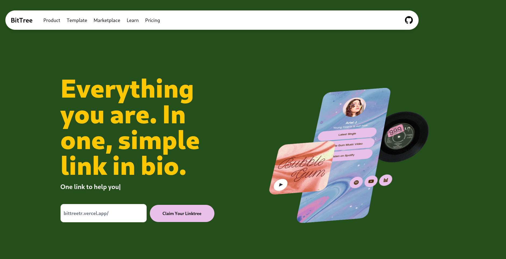
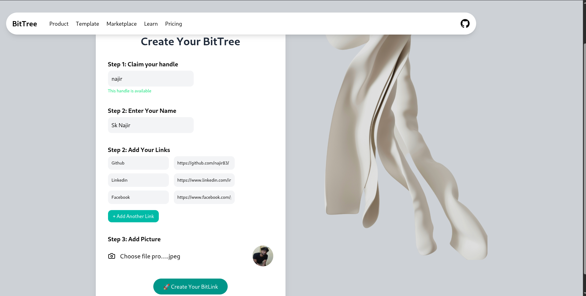

# 🌳 Bittree

**Bittree** is a free, no-registration alternative to Linktree. Instantly create a personalized page to share your most important links — perfect for Instagram bios, portfolios, or any profile!

> ⚡ No login. No database. Just fast, simple link sharing.

---

## 🔗 Live Demo

> 👉[bittreetr.vercel.app](https://bittreetr.vercel.app)

### Create your own page like this:  

> #### https://bittreetr.vercel.app/najir
 

---                                                 


## 📸 Screenshot

- Home Page
 
- Generate Page
 

                                       

## 🚀 Features

- ✅ Add multiple custom links under a unique handle
- 🎨 Minimal and elegant design
- 📱 Fully responsive and mobile-friendly
- 🔐 No sign-up required
- ⚡ Built for speed and simplicity

---

## 🛠️ Tech Stack

- **Framework:** [Next.js](https://nextjs.org/)
- **Styling:** [Tailwind CSS](https://tailwindcss.com/)
- **Hosting:** [Vercel](https://vercel.com/)
- **Icons:** [Lucide React](https://lucide.dev/)

---

## 🧑‍💻 How It Works

1. Add your links and handle to the URL like:
> https://bittreetr.vercel.app/generate

2. Your unique link page is automatically rendered.
3. Share that link anywhere!

---

## 📂 Project Structure

### bittree/
- #### ├── app/ # Next.js app directory 
- #### ├── components/ # Reusable UI components
- #### ├── public/ # Static files
- #### ├── models/ # Mongoose Model
- #### ├──  lib/ # Utility functions (if any)


---

## 🧪 Local Development

```bash
# Clone the repository
git clone https://github.com/najir83/bittree.git
cd bittree

# Install dependencies
npm install

# Run the development server
npm run dev
